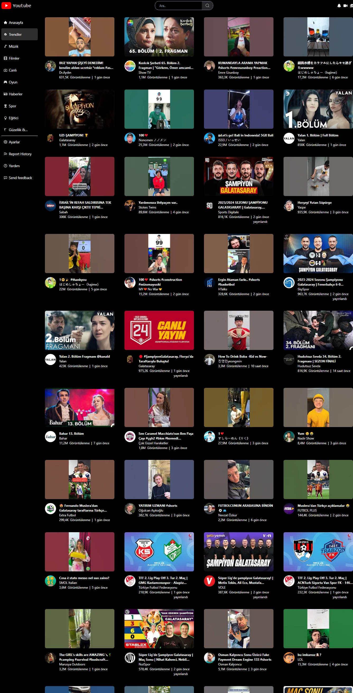
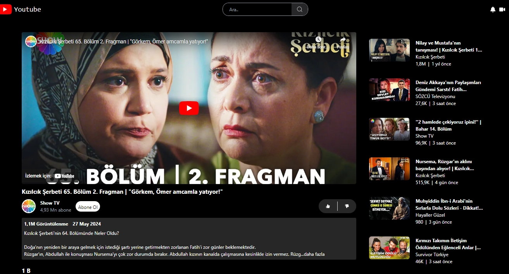
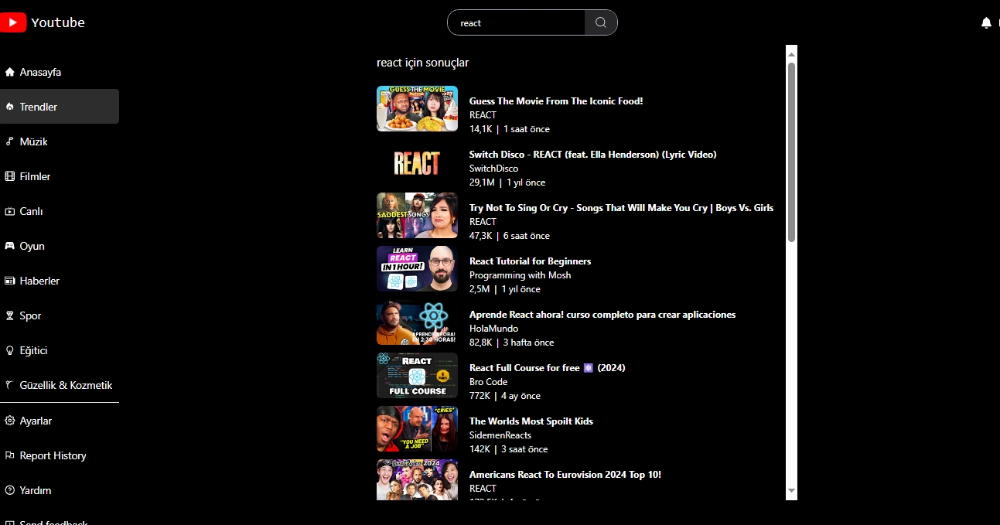

## Youtube-Clon

Bu proje, YouTube'un temel özelliklerini içeren bir klondur. Proje React Context API kullanılarak oluşturulmuştur ve aşağıdaki kütüphaneleri içermektedir:

- axios: HTTP istekleri için
- millify: Sayıları okunabilir formata dönüştürmek için
- moment: Tarih ve saat işlemleri için
- react: React bileşenlerini oluşturmak için
- react-dom: React uygulamasını DOM'a bağlamak için
- react-icons`: İkon seti için
- react-player: Video oynatıcı bileşeni için
- react-router-dom: Routing işlemleri için

## Özellikler

- Video oynatma
- Video arama
- Kanal sayfası
- Yorumlar ve beğeniler
- Abonelikler
- Ve daha fazlası...

# Ekran görüntüleri

# GİF

